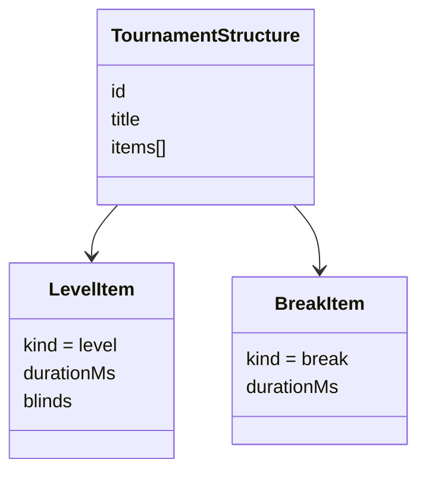

# Domain Model

```mermaid
classDiagram

class TournamentStructure {
  id
  title
  items[]
}

class LevelItem {
  kind = level
  durationMs
  blinds
}

class BreakItem {
  kind = break
  durationMs
}

TournamentStructure --> LevelItem
TournamentStructure --> BreakItem
```