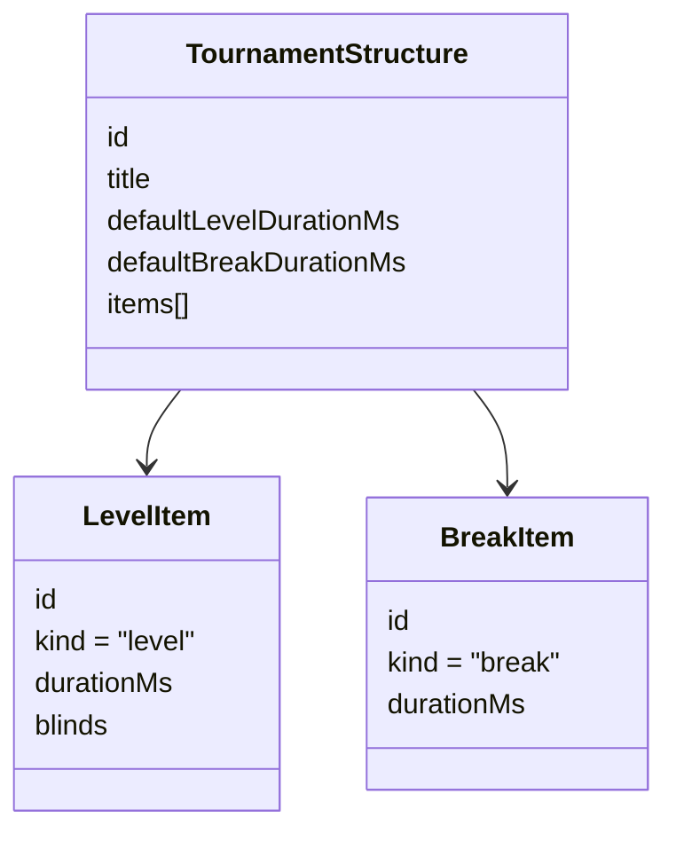

# Domain Model Diagram

```mermaid
classDiagram

class TournamentStructure {
  id
  title
  defaultLevelDurationMs
  defaultBreakDurationMs
  items[]
}

class LevelItem {
  id
  kind = "level"
  durationMs
  blinds
}

class BreakItem {
  id
  kind = "break"
  durationMs
}

TournamentStructure --> LevelItem
TournamentStructure --> BreakItem
```
