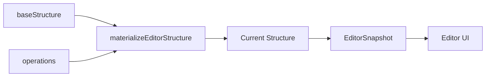

# Editor Operation Model

```mermaid
flowchart LR

Base[baseStructure]
Ops[operations]
Materialize[materializeEditorStructure]
Draft[Current Structure]
Snapshot[EditorSnapshot]
UI[Editor UI]

Base --> Materialize
Ops --> Materialize
Materialize --> Draft
Draft --> Snapshot
Snapshot --> UI
```
