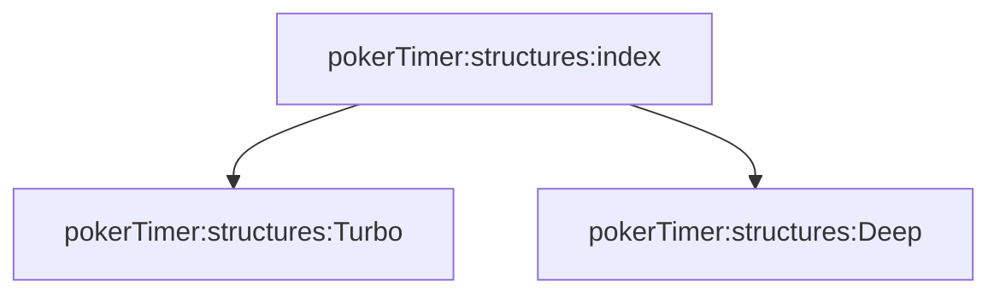

# Preset Storage Diagram

```mermaid
flowchart TD

Index["pokerTimer:structures:index"]
PresetA["pokerTimer:structures:Turbo"]
PresetB["pokerTimer:structures:Deep"]

Index --> PresetA
Index --> PresetB
```
